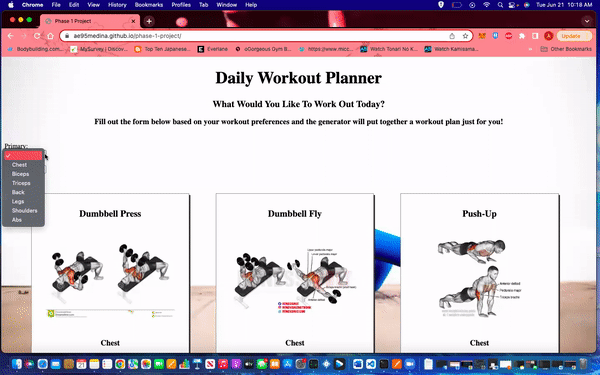

# Workout Planner

### Overview
Have you ever had a day where you wanted to exercise but didn't have a set plan on what to do? Have your workouts become repetitive and therefore boring? Are you new to fitness and don't know where to start? If you can relate to any of these, this application is for you.

Welcome to the Workout Planner! The Workout Planner is an application made for beginners and experts alike. The workout is specifically catered to you. Input whatever muscle group you'd like to target and we will create a workout plan based on what you've chosen.

### Features
 - Muscle-specific workout formula
 - Many combinations to choose from
 - Images explaining the "how-to" of the workout
 - Select your preferred workouts to set them apart from the others

### How to Use
Choose your desired target muscle group; you can select one group, or combine with another. After selecting the input(s), your workout cards will then filter and appear below.
 / ! 